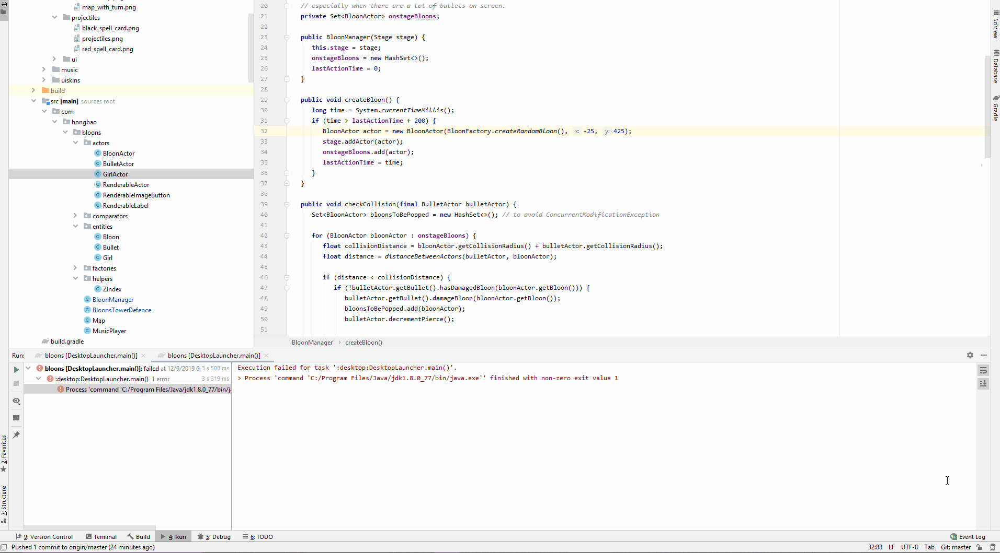

# bloons
George is messing around with LibGDX and would eventually like to make Bloons Tower Defense.

To run the "game", just run DesktopLauncher.

I'm currently reading up on examples from https://www.gamefromscratch.com/page/LibGDX-Tutorial-series.aspx, which is a little dated but otherwise fine.
I'm using https://www.iloveimg.com/crop-image/crop-png since Microsoft paint doesn't seem to let me crop with a transparent background.

Ideas that are not yet implemented that I would like to implement:

- More bloon types
- Have bloons potentially spawn multiple lesser bloons when popped
- More maps
- Instructions screen
- Ability to upgrade towers
- Ability to sell towers
- Sound control
- Regen and camo bloon functionality
- Homing bullets for Reimu
- Spell cards (ultimate attacks) for towers that have a separate cooldown