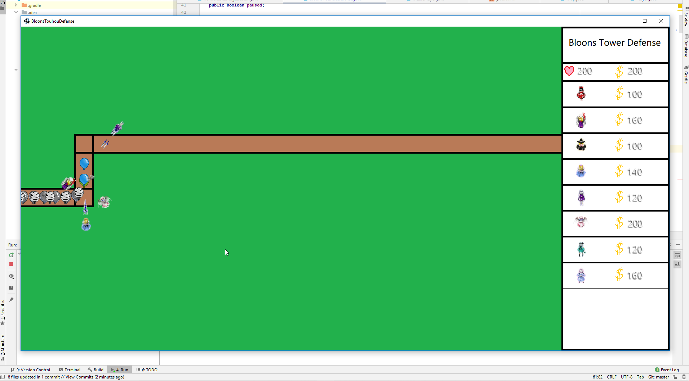
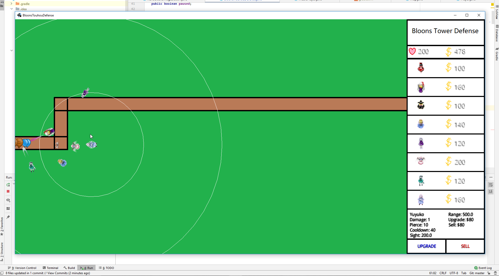
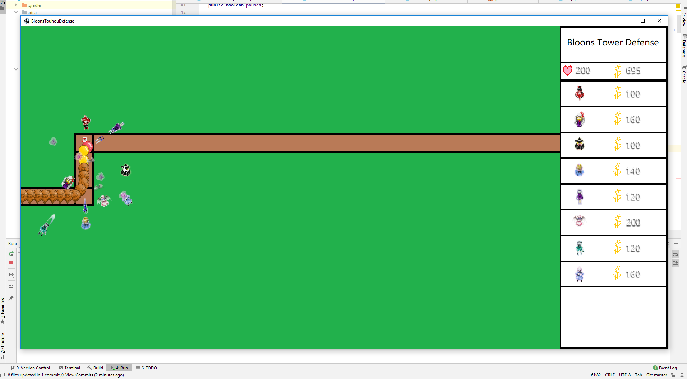
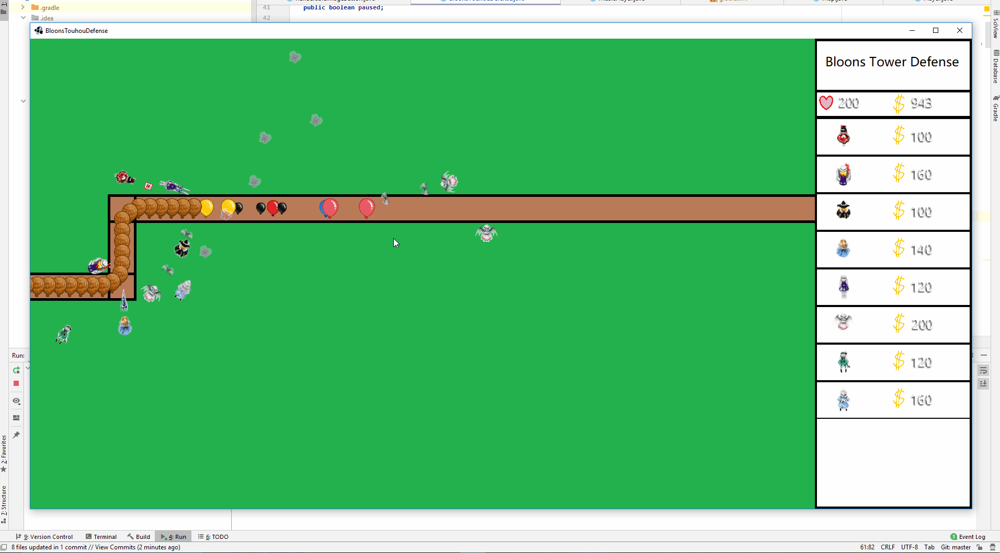

# bloons
George is messing around with LibGDX and would eventually like to make Bloons Tower Defense.

To run the "game", just run DesktopLauncher.

I'm currently reading up on examples from https://www.gamefromscratch.com/page/LibGDX-Tutorial-series.aspx, which is a little dated but otherwise fine.
I'm using https://www.iloveimg.com/crop-image/crop-png since Microsoft paint doesn't seem to let me crop with a transparent background.

Ideas that are not yet implemented that I would like to implement:

- Ability to upgrade towers
-- Maybe make hovering over the upgrade button show the upgraded tower stats in the UI

- Homing bullets for Reimu
-- Should probably lock on to a different nearby bloon if the original target has expired.

- Have bloons potentially spawn multiple lesser bloons when popped
-- Revamp how popping works

- More bloon types
-- Blimps that may need its own class and needs to be able to rotate based on its direction

- Regen and camo bloon functionality
-- Need to figure out which towers shouldn't detect camo bloons... Probably just Marisa and Youmu but idk lol
-- Regen should probably wait after the "Have bloons potentially spawn multiple lesser bloons"

- More maps

- Instructions screen

- Sound control

- Spell cards (ultimate attacks) for towers that have a separate cooldown
-- This sounds hard but would be really cool